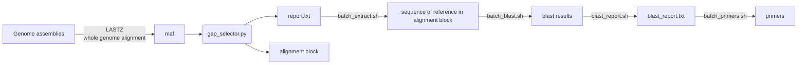

用于基于WGA或NGS测序批量设计Indel标记引物

# 全基因组比对（WGA）


## 1. WGA

使用`LASTZ`进行全基因组比对，使用`--chain`参数只输出对角线，结果保存为MAF格式（`--format=maf`）

## 2. 筛选Indel位点

使用`gap_selector.py`从MAF文件中筛选符合要求的Indel（长度>=15），分别输出所有包含Indel的Alignment block（fasta格式）和Indel的信息（`report.txt`，所属alignment block名称、编号、起止坐标、相对reference的坐标）

## 3. 提取Indel位点两翼序列

使用`batch_extract.sh`读取`report.txt`并提取reference中所有Indel位点两翼300bp序列

## 4. BLAST

使用`batch_blast.sh`对Indel位点两翼序列进行BLAST搜索，使用`blast_report.sh`统计hit数量，结果输出至`blast_report.txt`

## 5. 批量设计引物

使用`batch_primers.sh`筛选blast结果，只保留单拷贝结果，调用`primer3`设计PCR引物

# NGS测序+变异检测

对于基于NGS的变异检测获得的Indel位点，只需要提取所有Indel位点两翼序列，即可套用基于WGA的工作流程

可以使用以下脚本根据vcf文件提取序列

```sh
flank_len=300
ref="XXX.fa"

for line in $(bcftools view -H input.vcf)
do
  chr=$(echo ${line} | cut -f 1)
  pos=$(echo ${line} | cut -f 2)

  start=$((pos - flank_len))
  end=$((pos + flank_len))

  seqkit grep -p ${chr} ${ref} | seqkit subseq -Rr "${start}:${end}" > seqextr/${chr}_${pos}.fa
done
```
